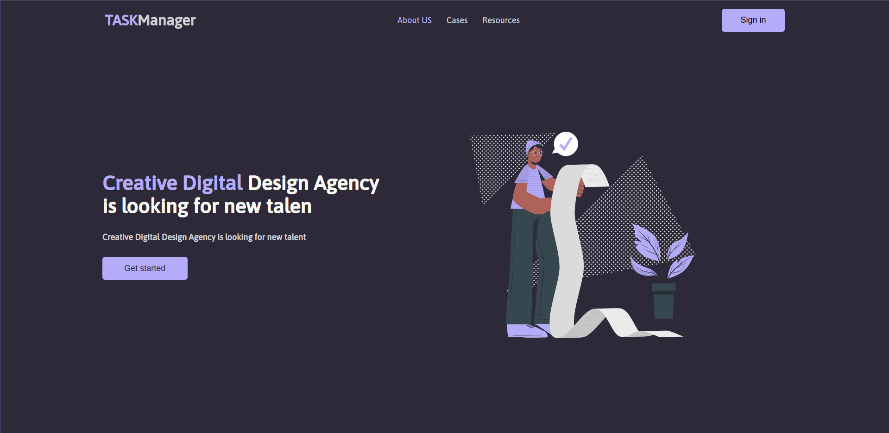

<h1 align="center">Welcome to TaskManager 👋</h1>
<p align="center">
    
    &nbsp;&nbsp;
    &nbsp;&nbsp;
    
</p>
<p align="center">
    <a href="#project">Project</a>&nbsp;&nbsp;&nbsp;|&nbsp;&nbsp;&nbsp;
    <a href="#installation">Installation</a>&nbsp;&nbsp;&nbsp;|&nbsp;&nbsp;&nbsp;
    <a href="#technology">Technology</a>&nbsp;&nbsp;&nbsp;|&nbsp;&nbsp;&nbsp;
    <a href="#license">License</a>
</p><br>

<span id="project">`taskmanager`</span> is a web site for managing tasks as the name says `taskmanager` it serves to store all your tasks in a serie order and it not only serves to store only tasks it can also store things you don't want to forget like someone's name etc...

The base technology for creating this project was the [React](https://reactjs.org/)(`17.0.2`) to develop this project I took about 4 days after some trial and error, This website is fully responsive and can be accessed from any device, you can access the layout of this project by clicking [here](https://www.figma.com/file/TVT3dZ8snysCn9XgLmtjJX/SnirTask?node-id=3%3A2242).<br><br>

>The project was hosted on the verser website and you can access the project using this link: https://taskmanager-tau.vercel.app/

> You can castrate yourself in `TaskManager` from your Email or Facebook account.

## ✨ preview

Home page

<p align="center">
  
</p>

## <span id="installation">👨‍💻 Quick Start</span>

To use the website on your local machine follow the steps below:

Cloning the Repository:

```sh
git clone https://github.com/lietsondossanto/taskmanager.git
```

Accessing the project folder:

```sh
cd taskmanager
```

Install dependeces:

```sh
yarn
```

execute:

```sh
yarn start
```

## <span id="technology">🚀 Technologies</span>

This project was developed with the following technologies:

- [React](https://reactjs.org/)
- [Styled-components](https://styled-components.com/)
- [polished](https://polished.js.org/)
- [react-router-dom](https://reactrouter.com/web/guides/quick-start)
- [universal-cookie](https://github.com/reactivestack/cookies/tree/master/packages/universal-cookie)
- [yup](https://github.com/jquense/yup)
- [formik](https://formik.org/)
- [firebase](https://firebase.google.com/docs?gclid=CjwKCAjwn8SLBhAyEiwAHNTJbaJlttA-1Tr0l9kWQygvUT8UsRm5N0HZWs_eTQJqQP1CRNr5nn9HyRoCX9kQAvD_BwE&gclsrc=aw.ds)

## 🤝 Contributing
- Fork this repository;
- Create a branch with your feature: `git checkout -b my-feature`;
- commit your changes: `git commit -m 'feat: my-new-feature'`;
- push to your branch: `git push origin my-feature`.

## Author

👤 **Lietson Dos Santos**

- Twitter: [@lietsondossanto](https://twitter.com/lietsondossanto)
- Github: [@lietsondossanto](https://github.com/lietsondossanto)
<br />
<h2 id="license">📝 License</h2>

---
This project is licensed under the MIT License - see the [LICENSE.md](LICENSE.md) file for details<br><br>
Copyright © 2021 [Lietson Dos Santos](https://github.com/lietsondossanto).
